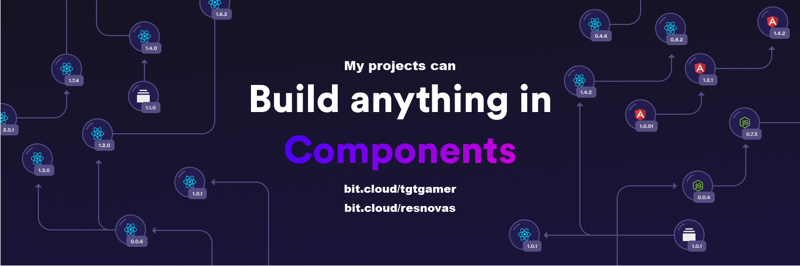

  
  

  
###  I'm Jonathan, a full-time remote developer focusing on serverless infrastructure👨‍💻

I’m currently working on [Eventiva](https://github.com/eventiva/eventiva)  
I’m currently learning [Terraform](https://www.terraform.io/), [Mitosis](https://mitosis.builder.io/) and [Qwik](https://qwik.builder.io/)  
Find me answering community coding questions in [The Coding Den](https://discord.com/invite/code) and [TypeScript Community](https://discord.gg/typescript)

 

<picture>
  <source media="(prefers-color-scheme: dark)" srcset="games/github-snake-dark.svg" />
  <source media="(prefers-color-scheme: light)" srcset="games/github-snake.svg" />
  
</picture>

<table><tr><td valign="top" width="33%">

### Frontend

  
  
  
  
  
  
  
  
  
  
  
  
  

</td><td valign="top" width="33%">

### Backend

  
  
  
  
  
  
  
  

</td><td valign="top" width="33%">

### DevOps

  
  
  
  
  
  
  

</td></tr></table>

<table style="border: none;"><tr style="border: none;"><td valign="top" width="50%" style="border: none;">

</td><td valign="top" width="50%" style="border: none;">

</td></tr></table>

<table style="border: none;"><tr style="border: none;"><td valign="top" width="80%" style="border: none;">

</td><td valign="top" width="20%" style="border: none;">

  

</td></tr></table>

 

 Activity 

  
<table><tr><td valign="top" width="50%">

<!--START_SECTION:activity-->

1. 🎉 Merged PR [#4](https://github.com/Eventiva/zenstack/pull/4) in [Eventiva/zenstack](https://github.com/Eventiva/zenstack)
2. ❌ Closed PR [#3](https://github.com/Eventiva/zenstack/pull/3) in [Eventiva/zenstack](https://github.com/Eventiva/zenstack)
3. 🎉 Merged PR [#2](https://github.com/Eventiva/zenstack/pull/2) in [Eventiva/zenstack](https://github.com/Eventiva/zenstack)
4. 🗣 Commented on [#2](https://github.com/Eventiva/zenstack/pull/2#issuecomment-1951607726) in [Eventiva/zenstack](https://github.com/Eventiva/zenstack)
5. 💪 Opened PR [#2](https://github.com/Eventiva/zenstack/pull/2) in [Eventiva/zenstack](https://github.com/Eventiva/zenstack)
6. ❌ Closed PR [#1](https://github.com/TGTGamer/zenstack/pull/1) in [TGTGamer/zenstack](https://github.com/TGTGamer/zenstack)
7. 💪 Opened PR [#1](https://github.com/TGTGamer/zenstack/pull/1) in [TGTGamer/zenstack](https://github.com/TGTGamer/zenstack)
8. 🔓 Reopened issue [#56](https://github.com/Eventiva/Eventiva/issues/56) in [Eventiva/Eventiva](https://github.com/Eventiva/Eventiva)
9. ❗ Opened issue [#1008](https://github.com/zenstackhq/zenstack/issues/1008) in [zenstackhq/zenstack](https://github.com/zenstackhq/zenstack)
10. 🗣 Commented on [#770](https://github.com/zenstackhq/zenstack/issues/770#issuecomment-1951519425) in [zenstackhq/zenstack](https://github.com/zenstackhq/zenstack)
11. 🗣 Commented on [#68](https://github.com/zenstackhq/zenstack/issues/68#issuecomment-1951516788) in [zenstackhq/zenstack](https://github.com/zenstackhq/zenstack)
12. 🎉 Merged PR [#534](https://github.com/Eventiva/Eventiva/pull/534) in [Eventiva/Eventiva](https://github.com/Eventiva/Eventiva)
13. 🎉 Merged PR [#525](https://github.com/Eventiva/Eventiva/pull/525) in [Eventiva/Eventiva](https://github.com/Eventiva/Eventiva)
14. 🎉 Merged PR [#535](https://github.com/Eventiva/Eventiva/pull/535) in [Eventiva/Eventiva](https://github.com/Eventiva/Eventiva)
15. 💪 Opened PR [#29](https://github.com/bit-tasks/pull-request/pull/29) in [bit-tasks/pull-request](https://github.com/bit-tasks/pull-request)
16. 🎉 Merged PR [#3](https://github.com/Eventiva/bit-pull-request/pull/3) in [Eventiva/bit-pull-request](https://github.com/Eventiva/bit-pull-request)
17. 💪 Opened PR [#10](https://github.com/bit-tasks/tag-export/pull/10) in [bit-tasks/tag-export](https://github.com/bit-tasks/tag-export)
18. 🎉 Merged PR [#2](https://github.com/Eventiva/tag-export/pull/2) in [Eventiva/tag-export](https://github.com/Eventiva/tag-export)
19. 💪 Opened PR [#1](https://github.com/bit-tasks/verify/pull/1) in [bit-tasks/verify](https://github.com/bit-tasks/verify)
20. 🎉 Merged PR [#3](https://github.com/Eventiva/bit-verify/pull/3) in [Eventiva/bit-verify](https://github.com/Eventiva/bit-verify)
21. 💪 Opened PR [#3](https://github.com/Eventiva/bit-verify/pull/3) in [Eventiva/bit-verify](https://github.com/Eventiva/bit-verify)
22. 💪 Opened PR [#2](https://github.com/Eventiva/tag-export/pull/2) in [Eventiva/tag-export](https://github.com/Eventiva/tag-export)
23. 💪 Opened PR [#3](https://github.com/Eventiva/bit-pull-request/pull/3) in [Eventiva/bit-pull-request](https://github.com/Eventiva/bit-pull-request)
24. 🎉 Merged PR [#2](https://github.com/Eventiva/bit-lane-cleanup/pull/2) in [Eventiva/bit-lane-cleanup](https://github.com/Eventiva/bit-lane-cleanup)
25. 💪 Opened PR [#1](https://github.com/bit-tasks/commit-bitmap/pull/1) in [bit-tasks/commit-bitmap](https://github.com/bit-tasks/commit-bitmap)
26. 🎉 Merged PR [#2](https://github.com/Eventiva/bit-commit-bitmap/pull/2) in [Eventiva/bit-commit-bitmap](https://github.com/Eventiva/bit-commit-bitmap)
27. 💪 Opened PR [#2](https://github.com/Eventiva/bit-lane-cleanup/pull/2) in [Eventiva/bit-lane-cleanup](https://github.com/Eventiva/bit-lane-cleanup)
28. ❌ Closed PR [#4](https://github.com/bit-tasks/lane-cleanup/pull/4) in [bit-tasks/lane-cleanup](https://github.com/bit-tasks/lane-cleanup)
29. 💪 Opened PR [#4](https://github.com/bit-tasks/lane-cleanup/pull/4) in [bit-tasks/lane-cleanup](https://github.com/bit-tasks/lane-cleanup)
30. 💪 Opened PR [#2](https://github.com/Eventiva/bit-commit-bitmap/pull/2) in [Eventiva/bit-commit-bitmap](https://github.com/Eventiva/bit-commit-bitmap)
31. 💪 Opened PR [#1](https://github.com/bit-tasks/branch-lane/pull/1) in [bit-tasks/branch-lane](https://github.com/bit-tasks/branch-lane)
32. 🎉 Merged PR [#2](https://github.com/Eventiva/bit-branch-lane/pull/2) in [Eventiva/bit-branch-lane](https://github.com/Eventiva/bit-branch-lane)
33. 💪 Opened PR [#2](https://github.com/Eventiva/bit-branch-lane/pull/2) in [Eventiva/bit-branch-lane](https://github.com/Eventiva/bit-branch-lane)
34. ❌ Reopened PR [#4](https://github.com/Eventiva/bit-init/pull/4) in [Eventiva/bit-init](https://github.com/Eventiva/bit-init)
<!--END_SECTION:activity-->

</td></tr></table>

 

 
 Blogging & StackExchange 

  
<!-- BLOG-POST-LIST:START -->
- [PDF-Lib - React Native - Embed Images - image.scaleToFit Error Thrown](https://stackoverflow.com/questions/75745732/pdf-lib-react-native-embed-images-image-scaletofit-error-thrown)
- [Tensorflow React - Error: modelWeightsID must be a number or number array when import](https://stackoverflow.com/questions/74309939/tensorflow-react-error-modelweightsid-must-be-a-number-or-number-array-when-i)
- [Answer by Jonathan Stevens for Fetch status on audio stream - HTTP Response](https://stackoverflow.com/questions/67752301/fetch-status-on-audio-stream-http-response/67757137#67757137)
- [Fetch status on audio stream - HTTP Response](https://stackoverflow.com/questions/67752301/fetch-status-on-audio-stream-http-response)
- [Github Actions detect author_association](https://stackoverflow.com/questions/63188674/github-actions-detect-author-association)
- [Answer by Jonathan Stevens for React styling - Overflow issues - Expo &amp; Electron single workflow](https://stackoverflow.com/questions/59939824/react-styling-overflow-issues-expo-electron-single-workflow/59941715#59941715)
- [React styling - Overflow issues - Expo &amp; Electron single workflow](https://stackoverflow.com/questions/59939824/react-styling-overflow-issues-expo-electron-single-workflow)
- [React WebkitAppRegion Warnings](https://stackoverflow.com/questions/59870837/react-webkitappregion-warnings)
- [Dialogflow &amp; Express -- Fulfilment](https://stackoverflow.com/questions/57964582/dialogflow-express-fulfilment)
- [Answer by Jonathan Stevens for SVG Changing specific colour - CSS &amp; JS](https://stackoverflow.com/questions/51461082/svg-changing-specific-colour-css-js/51467484#51467484)
- [SVG Changing specific colour - CSS &amp; JS](https://stackoverflow.com/questions/51461082/svg-changing-specific-colour-css-js)
- [Complex Wireframe to solid for use in Autodesk 2018](https://stackoverflow.com/questions/47948929/complex-wireframe-to-solid-for-use-in-autodesk-2018)
- [Cookie based Redirection using Javascript](https://stackoverflow.com/questions/47686107/cookie-based-redirection-using-javascript)
- [How to make the bot know if its messaged someone before? C# based SteamBot](https://stackoverflow.com/questions/44035406/how-to-make-the-bot-know-if-its-messaged-someone-before-c-sharp-based-steambot)
- [How to convert fs:path to variable](https://stackoverflow.com/questions/43879791/how-to-convert-fspath-to-variable)
<!-- BLOG-POST-LIST:END -->
  

 
