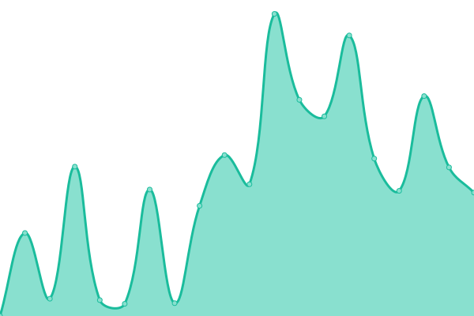
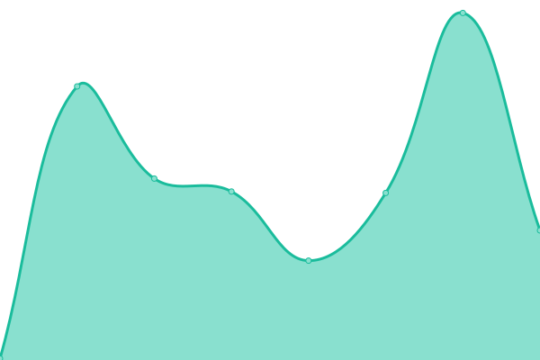
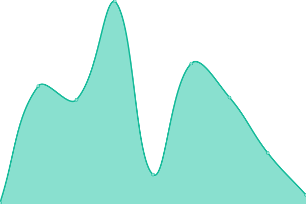
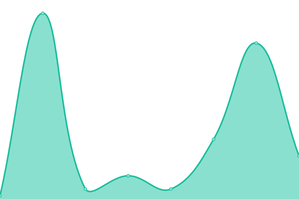
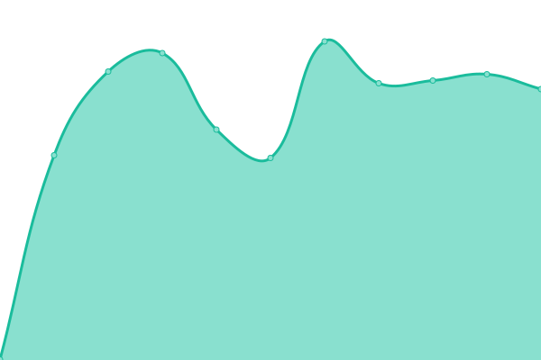

<div align="center">


</div>

<div align="center">


</div>  
  
<div align="center">
  
###  I'm Jonathan, a full-time remote developer focusing on serverless infrastructure👨‍💻

I’m currently working on [Eventiva](https://github.com/resnovas/eventiva) and [Zerdalab UX Projects](https://github.com/Zerdalab)  
I’m currently learning [Terraform](https://www.terraform.io/), [Mitosis](https://mitosis.builder.io/) and [Qwik](https://qwik.builder.io/)  
Find me answering community coding questions in [The Coding Den](https://discord.com/invite/code) and [TypeScript Community](https://discord.gg/typescript)

</div>
<br/>

## My Skill Set

<table><tr><td valign="top" width="33%">

### Frontend

<div align="center">  
<a href="https://www.adobe.com/in/products/xd.html" target="_blank"></a>  
<a href="https://www.adobe.com/in/products/illustrator.html" target="_blank"></a>  
<a href="https://www.adobe.com/in/products/photoshop.html" target="_blank"></a>  
<a href="https://www.adobe.com/in/products/aftereffects.html" target="_blank"></a>  
<a href="https://www.adobe.com/in/products/indesign.html" target="_blank"></a>  
<a href="https://wordpress.com/" target="_blank"></a>  
<a href="https://www.javascript.com/" target="_blank"></a>  
<a href="https://www.typescriptlang.org/" target="_blank"></a>  
<a href="https://reactjs.org/" target="_blank"></a>  
<a href="https://en.wikipedia.org/wiki/HTML5" target="_blank"></a>  
<a href="https://www.electronjs.org/" target="_blank"></a>  
<a href="https://www.w3schools.com/css/" target="_blank"></a>  
</div>

</td><td valign="top" width="33%">

### Backend

<div align="center">  
<a href="https://nodejs.org/" target="_blank"></a>  
<a href="https://www.typescriptlang.org/" target="_blank"></a>  
<a href="https://graphql.org/" target="_blank"></a>  
<a href="https://www.prisma.io/" target="_blank"></a>  
<a href="https://www.postgresql.org/" target="_blank"></a>  
<a href="https://expressjs.com/" target="_blank"></a>  
<a href="https://www.arduino.cc/" target="_blank"></a>  
</div>

</td><td valign="top" width="33%">

### DevOps

<div align="center">  
<a href="https://cloud.google.com/" target="_blank"></a>  
<a href="https://aws.amazon.com/" target="_blank"></a>  
<a href="https://www.terraform.io/" target="_blank"></a>  
<a href="https://github.com/" target="_blank"></a>  
<a href="https://gulpjs.com/" target="_blank"></a>  
<a href="https://about.gitlab.com/" target="_blank"></a>  
</div>

</td></tr></table>

<br/>

## Connect with me

<table><tr><td valign="top" width="50%">

<div align="center">
<a href="https://github.com/TGTGamer" target="_blank">

</a>
<a href="https://twitter.com/TGTGamer" target="_blank">

</a>
<a href="https://dev.to/TGTGamer" target="_blank">

</a>
<a href="https://linkedin.com/in/tgtgamer" target="_blank">

</a>
<a href="https://www.facebook.com/jonathanstevens144" target="_blank">

</a>
<a href="https://instagram.com/tgtgamer" target="_blank">

</a>
<a href="https://gitlab.com/TGTGamer" target="_blank">

</a>
<a href="https://hashnode.com/@TGTGamer" target="_blank">

</a>
<a href="https://codepen.com/TGTGamer" target="_blank">

</a>  
</div>

</td><td valign="top" width="50%">


</td></tr></table>

<br/>

## Project Status

<p align="center">
    
</p>
  
<div align="center">
  
[📈 Service Live Status](https://resnovas.github.io/Eventiva/): <!--live status--> **🟧 Partial outage**

<!--start: status pages-->
<!-- This summary is generated by Upptime (https://github.com/upptime/upptime) -->
<!-- Do not edit this manually, your changes will be overwritten -->
<!-- prettier-ignore -->
| URL | Status | History | Response Time | Uptime |
| --- | ------ | ------- | ------------- | ------ |
|  [Resnovas - **under development**](https://resnovas.co.uk) | 🟩 Up | [resnovas-under-development.yml](https://github.com/TGTGamer/TGTGamer/commits/HEAD/history/resnovas-under-development.yml) | <details><summary> 1408ms</summary><br><a href="https://TGTGamer.github.io/TGTGamer/history/resnovas-under-development"></a><br><a href="https://TGTGamer.github.io/TGTGamer/history/resnovas-under-development"></a><br><a href="https://TGTGamer.github.io/TGTGamer/history/resnovas-under-development"></a><br><a href="https://TGTGamer.github.io/TGTGamer/history/resnovas-under-development"></a><br><a href="https://TGTGamer.github.io/TGTGamer/history/resnovas-under-development"></a></details> | <details><summary><a href="https://TGTGamer.github.io/TGTGamer/history/resnovas-under-development">100.00%</a></summary><a href="https://TGTGamer.github.io/TGTGamer/history/resnovas-under-development"></a><br><a href="https://TGTGamer.github.io/TGTGamer/history/resnovas-under-development"></a><br><a href="https://TGTGamer.github.io/TGTGamer/history/resnovas-under-development"></a><br><a href="https://TGTGamer.github.io/TGTGamer/history/resnovas-under-development"></a><br><a href="https://TGTGamer.github.io/TGTGamer/history/resnovas-under-development"></a></details>
|  [Guard Dog Gaming - **under development**](https://www.gdgaming.net) | 🟩 Up | [guard-dog-gaming-under-development.yml](https://github.com/TGTGamer/TGTGamer/commits/HEAD/history/guard-dog-gaming-under-development.yml) | <details><summary> 839ms</summary><br><a href="https://TGTGamer.github.io/TGTGamer/history/guard-dog-gaming-under-development"></a><br><a href="https://TGTGamer.github.io/TGTGamer/history/guard-dog-gaming-under-development"></a><br><a href="https://TGTGamer.github.io/TGTGamer/history/guard-dog-gaming-under-development"></a><br><a href="https://TGTGamer.github.io/TGTGamer/history/guard-dog-gaming-under-development"></a><br><a href="https://TGTGamer.github.io/TGTGamer/history/guard-dog-gaming-under-development"></a></details> | <details><summary><a href="https://TGTGamer.github.io/TGTGamer/history/guard-dog-gaming-under-development">100.00%</a></summary><a href="https://TGTGamer.github.io/TGTGamer/history/guard-dog-gaming-under-development"></a><br><a href="https://TGTGamer.github.io/TGTGamer/history/guard-dog-gaming-under-development"></a><br><a href="https://TGTGamer.github.io/TGTGamer/history/guard-dog-gaming-under-development"></a><br><a href="https://TGTGamer.github.io/TGTGamer/history/guard-dog-gaming-under-development"></a><br><a href="https://TGTGamer.github.io/TGTGamer/history/guard-dog-gaming-under-development"></a></details>
|  [Smartcloud](https://resnovas.github.io/smartcloud/) | 🟩 Up | [smartcloud.yml](https://github.com/TGTGamer/TGTGamer/commits/HEAD/history/smartcloud.yml) | <details><summary> 85ms</summary><br><a href="https://TGTGamer.github.io/TGTGamer/history/smartcloud"></a><br><a href="https://TGTGamer.github.io/TGTGamer/history/smartcloud"></a><br><a href="https://TGTGamer.github.io/TGTGamer/history/smartcloud"></a><br><a href="https://TGTGamer.github.io/TGTGamer/history/smartcloud"></a><br><a href="https://TGTGamer.github.io/TGTGamer/history/smartcloud"></a></details> | <details><summary><a href="https://TGTGamer.github.io/TGTGamer/history/smartcloud">100.00%</a></summary><a href="https://TGTGamer.github.io/TGTGamer/history/smartcloud"></a><br><a href="https://TGTGamer.github.io/TGTGamer/history/smartcloud"></a><br><a href="https://TGTGamer.github.io/TGTGamer/history/smartcloud"></a><br><a href="https://TGTGamer.github.io/TGTGamer/history/smartcloud"></a><br><a href="https://TGTGamer.github.io/TGTGamer/history/smartcloud"></a></details>
|  [Eventiva - Status Page](https://resnovas.github.io/Eventiva) | 🟩 Up | [eventiva-status-page.yml](https://github.com/TGTGamer/TGTGamer/commits/HEAD/history/eventiva-status-page.yml) | <details><summary> 67ms</summary><br><a href="https://TGTGamer.github.io/TGTGamer/history/eventiva-status-page"></a><br><a href="https://TGTGamer.github.io/TGTGamer/history/eventiva-status-page"></a><br><a href="https://TGTGamer.github.io/TGTGamer/history/eventiva-status-page"></a><br><a href="https://TGTGamer.github.io/TGTGamer/history/eventiva-status-page"></a><br><a href="https://TGTGamer.github.io/TGTGamer/history/eventiva-status-page"></a></details> | <details><summary><a href="https://TGTGamer.github.io/TGTGamer/history/eventiva-status-page">100.00%</a></summary><a href="https://TGTGamer.github.io/TGTGamer/history/eventiva-status-page"></a><br><a href="https://TGTGamer.github.io/TGTGamer/history/eventiva-status-page"></a><br><a href="https://TGTGamer.github.io/TGTGamer/history/eventiva-status-page"></a><br><a href="https://TGTGamer.github.io/TGTGamer/history/eventiva-status-page"></a><br><a href="https://TGTGamer.github.io/TGTGamer/history/eventiva-status-page"></a></details>
|  [Rambo UI](https://resnovas.github.io/Rambo-UI) | 🟥 Down | [rambo-ui.yml](https://github.com/TGTGamer/TGTGamer/commits/HEAD/history/rambo-ui.yml) | <details><summary> 27ms</summary><br><a href="https://TGTGamer.github.io/TGTGamer/history/rambo-ui"></a><br><a href="https://TGTGamer.github.io/TGTGamer/history/rambo-ui"></a><br><a href="https://TGTGamer.github.io/TGTGamer/history/rambo-ui"></a><br><a href="https://TGTGamer.github.io/TGTGamer/history/rambo-ui"></a><br><a href="https://TGTGamer.github.io/TGTGamer/history/rambo-ui"></a></details> | <details><summary><a href="https://TGTGamer.github.io/TGTGamer/history/rambo-ui">0.00%</a></summary><a href="https://TGTGamer.github.io/TGTGamer/history/rambo-ui"></a><br><a href="https://TGTGamer.github.io/TGTGamer/history/rambo-ui"></a><br><a href="https://TGTGamer.github.io/TGTGamer/history/rambo-ui"></a><br><a href="https://TGTGamer.github.io/TGTGamer/history/rambo-ui"></a><br><a href="https://TGTGamer.github.io/TGTGamer/history/rambo-ui"></a></details>
|  [Web Hosting Systems](http://panel.resnovas.net/) | 🟩 Up | [web-hosting-systems.yml](https://github.com/TGTGamer/TGTGamer/commits/HEAD/history/web-hosting-systems.yml) | <details><summary> 2986ms</summary><br><a href="https://TGTGamer.github.io/TGTGamer/history/web-hosting-systems"></a><br><a href="https://TGTGamer.github.io/TGTGamer/history/web-hosting-systems"></a><br><a href="https://TGTGamer.github.io/TGTGamer/history/web-hosting-systems"></a><br><a href="https://TGTGamer.github.io/TGTGamer/history/web-hosting-systems"></a><br><a href="https://TGTGamer.github.io/TGTGamer/history/web-hosting-systems"></a></details> | <details><summary><a href="https://TGTGamer.github.io/TGTGamer/history/web-hosting-systems">100.00%</a></summary><a href="https://TGTGamer.github.io/TGTGamer/history/web-hosting-systems"></a><br><a href="https://TGTGamer.github.io/TGTGamer/history/web-hosting-systems"></a><br><a href="https://TGTGamer.github.io/TGTGamer/history/web-hosting-systems"></a><br><a href="https://TGTGamer.github.io/TGTGamer/history/web-hosting-systems"></a><br><a href="https://TGTGamer.github.io/TGTGamer/history/web-hosting-systems"></a></details>
|  Web Hosting Backend Service Primary | 🟩 Up | [web-hosting-backend-service-primary.yml](https://github.com/TGTGamer/TGTGamer/commits/HEAD/history/web-hosting-backend-service-primary.yml) | <details><summary> 536ms</summary><br><a href="https://TGTGamer.github.io/TGTGamer/history/web-hosting-backend-service-primary"></a><br><a href="https://TGTGamer.github.io/TGTGamer/history/web-hosting-backend-service-primary"></a><br><a href="https://TGTGamer.github.io/TGTGamer/history/web-hosting-backend-service-primary"></a><br><a href="https://TGTGamer.github.io/TGTGamer/history/web-hosting-backend-service-primary"></a><br><a href="https://TGTGamer.github.io/TGTGamer/history/web-hosting-backend-service-primary"></a></details> | <details><summary><a href="https://TGTGamer.github.io/TGTGamer/history/web-hosting-backend-service-primary">100.00%</a></summary><a href="https://TGTGamer.github.io/TGTGamer/history/web-hosting-backend-service-primary"></a><br><a href="https://TGTGamer.github.io/TGTGamer/history/web-hosting-backend-service-primary"></a><br><a href="https://TGTGamer.github.io/TGTGamer/history/web-hosting-backend-service-primary"></a><br><a href="https://TGTGamer.github.io/TGTGamer/history/web-hosting-backend-service-primary"></a><br><a href="https://TGTGamer.github.io/TGTGamer/history/web-hosting-backend-service-primary"></a></details>
|  [Chat Systems](https://chat.resnovas.com) | 🟩 Up | [chat-systems.yml](https://github.com/TGTGamer/TGTGamer/commits/HEAD/history/chat-systems.yml) | <details><summary> 943ms</summary><br><a href="https://TGTGamer.github.io/TGTGamer/history/chat-systems"></a><br><a href="https://TGTGamer.github.io/TGTGamer/history/chat-systems"></a><br><a href="https://TGTGamer.github.io/TGTGamer/history/chat-systems"></a><br><a href="https://TGTGamer.github.io/TGTGamer/history/chat-systems"></a><br><a href="https://TGTGamer.github.io/TGTGamer/history/chat-systems"></a></details> | <details><summary><a href="https://TGTGamer.github.io/TGTGamer/history/chat-systems">99.80%</a></summary><a href="https://TGTGamer.github.io/TGTGamer/history/chat-systems"></a><br><a href="https://TGTGamer.github.io/TGTGamer/history/chat-systems"></a><br><a href="https://TGTGamer.github.io/TGTGamer/history/chat-systems"></a><br><a href="https://TGTGamer.github.io/TGTGamer/history/chat-systems"></a><br><a href="https://TGTGamer.github.io/TGTGamer/history/chat-systems"></a></details>
|  [Feature Control](https://feature.resnovas.com) | 🟩 Up | [feature-control.yml](https://github.com/TGTGamer/TGTGamer/commits/HEAD/history/feature-control.yml) | <details><summary> 372ms</summary><br><a href="https://TGTGamer.github.io/TGTGamer/history/feature-control"></a><br><a href="https://TGTGamer.github.io/TGTGamer/history/feature-control"></a><br><a href="https://TGTGamer.github.io/TGTGamer/history/feature-control"></a><br><a href="https://TGTGamer.github.io/TGTGamer/history/feature-control"></a><br><a href="https://TGTGamer.github.io/TGTGamer/history/feature-control"></a></details> | <details><summary><a href="https://TGTGamer.github.io/TGTGamer/history/feature-control">99.71%</a></summary><a href="https://TGTGamer.github.io/TGTGamer/history/feature-control"></a><br><a href="https://TGTGamer.github.io/TGTGamer/history/feature-control"></a><br><a href="https://TGTGamer.github.io/TGTGamer/history/feature-control"></a><br><a href="https://TGTGamer.github.io/TGTGamer/history/feature-control"></a><br><a href="https://TGTGamer.github.io/TGTGamer/history/feature-control"></a></details>
|  DH1 Management | 🟩 Up | [dh-1-management.yml](https://github.com/TGTGamer/TGTGamer/commits/HEAD/history/dh-1-management.yml) | <details><summary> 582ms</summary><br><a href="https://TGTGamer.github.io/TGTGamer/history/dh-1-management"></a><br><a href="https://TGTGamer.github.io/TGTGamer/history/dh-1-management"></a><br><a href="https://TGTGamer.github.io/TGTGamer/history/dh-1-management"></a><br><a href="https://TGTGamer.github.io/TGTGamer/history/dh-1-management"></a><br><a href="https://TGTGamer.github.io/TGTGamer/history/dh-1-management"></a></details> | <details><summary><a href="https://TGTGamer.github.io/TGTGamer/history/dh-1-management">100.00%</a></summary><a href="https://TGTGamer.github.io/TGTGamer/history/dh-1-management"></a><br><a href="https://TGTGamer.github.io/TGTGamer/history/dh-1-management"></a><br><a href="https://TGTGamer.github.io/TGTGamer/history/dh-1-management"></a><br><a href="https://TGTGamer.github.io/TGTGamer/history/dh-1-management"></a><br><a href="https://TGTGamer.github.io/TGTGamer/history/dh-1-management"></a></details>

<!--end: status pages-->
</div>

###### <div align="center">Please note a majority of these are hosted on a local server in my office - so downtime expected 📶</div>

<br/>

## Github Stats

<div align="center">

</div>

<div align="center"><table><tr><td valign="top" width="50%">

<div align="center"></div>

</td><td valign="top" width="50%">

<div align="center"></div>

</td></tr></table></div>

<br/>

<br/>

<!--START_SECTION:waka-->

**🐱 My GitHub Data**

> 🏆 310 Contributions in the Year 2022
>
> 📦 743.9 kB Used in GitHub's Storage
>
> 💼 Opted to Hire
>
> 📜 20 Public Repositories
>
> 🔑 5 Private Repositories
>
> **I Mostly Code in TypeScript**

```text
TypeScript               6 repos             ⣿⣿⣿⣿⣿⣿⣿⣿⣿⣿⣀⣀⣀⣀⣀⣀⣀⣀⣀⣀⣀⣀⣀⣀⣀   42.86%
Dockerfile               2 repos             ⣿⣿⣿⣀⣀⣀⣀⣀⣀⣀⣀⣀⣀⣀⣀⣀⣀⣀⣀⣀⣀⣀⣀⣀⣀   14.29%
Markdown                 2 repos             ⣿⣿⣿⣀⣀⣀⣀⣀⣀⣀⣀⣀⣀⣀⣀⣀⣀⣀⣀⣀⣀⣀⣀⣀⣀   14.29%
PHP                      2 repos             ⣿⣿⣿⣀⣀⣀⣀⣀⣀⣀⣀⣀⣀⣀⣀⣀⣀⣀⣀⣀⣀⣀⣀⣀⣀   14.29%
JavaScript               1 repo              ⣿⣀⣀⣀⣀⣀⣀⣀⣀⣀⣀⣀⣀⣀⣀⣀⣀⣀⣀⣀⣀⣀⣀⣀⣀   7.14%

```

**Timeline**


Last Updated on 09/11/2022 18:41:18 UTC

<!--END_SECTION:waka-->

<br/>

<details><summary> Activity </summary>
  
<table><tr><td valign="top" width="50%">

<!--START_SECTION:activity-->

1. ❗️ Closed issue [#127](https://github.com/TGTGamer/TGTGamer/issues/127) in [TGTGamer/TGTGamer](https://github.com/TGTGamer/TGTGamer)
2. 🗣 Commented on [#127](https://github.com/TGTGamer/TGTGamer/issues/127) in [TGTGamer/TGTGamer](https://github.com/TGTGamer/TGTGamer)
3. ❗️ Opened issue [#127](https://github.com/TGTGamer/TGTGamer/issues/127) in [TGTGamer/TGTGamer](https://github.com/TGTGamer/TGTGamer)
4. ❗️ Closed issue [#126](https://github.com/TGTGamer/TGTGamer/issues/126) in [TGTGamer/TGTGamer](https://github.com/TGTGamer/TGTGamer)
5. 🗣 Commented on [#126](https://github.com/TGTGamer/TGTGamer/issues/126) in [TGTGamer/TGTGamer](https://github.com/TGTGamer/TGTGamer)
6. ❗️ Opened issue [#126](https://github.com/TGTGamer/TGTGamer/issues/126) in [TGTGamer/TGTGamer](https://github.com/TGTGamer/TGTGamer)
7. ❗️ Opened issue [#1361](https://github.com/BuilderIO/builder/issues/1361) in [BuilderIO/builder](https://github.com/BuilderIO/builder)
8. ❗️ Opened issue [#1360](https://github.com/BuilderIO/builder/issues/1360) in [BuilderIO/builder](https://github.com/BuilderIO/builder)
9. ❗️ Opened issue [#1359](https://github.com/BuilderIO/builder/issues/1359) in [BuilderIO/builder](https://github.com/BuilderIO/builder)
10. ❗️ Opened issue [#1358](https://github.com/BuilderIO/builder/issues/1358) in [BuilderIO/builder](https://github.com/BuilderIO/builder)
11. ❗️ Opened issue [#1357](https://github.com/BuilderIO/builder/issues/1357) in [BuilderIO/builder](https://github.com/BuilderIO/builder)
12. ❗️ Closed issue [#125](https://github.com/TGTGamer/TGTGamer/issues/125) in [TGTGamer/TGTGamer](https://github.com/TGTGamer/TGTGamer)
13. 🗣 Commented on [#125](https://github.com/TGTGamer/TGTGamer/issues/125) in [TGTGamer/TGTGamer](https://github.com/TGTGamer/TGTGamer)
14. ❗️ Opened issue [#125](https://github.com/TGTGamer/TGTGamer/issues/125) in [TGTGamer/TGTGamer](https://github.com/TGTGamer/TGTGamer)
15. ❗️ Closed issue [#124](https://github.com/TGTGamer/TGTGamer/issues/124) in [TGTGamer/TGTGamer](https://github.com/TGTGamer/TGTGamer)
16. 🗣 Commented on [#124](https://github.com/TGTGamer/TGTGamer/issues/124) in [TGTGamer/TGTGamer](https://github.com/TGTGamer/TGTGamer)
17. ❗️ Closed issue [#123](https://github.com/TGTGamer/TGTGamer/issues/123) in [TGTGamer/TGTGamer](https://github.com/TGTGamer/TGTGamer)
18. 🗣 Commented on [#123](https://github.com/TGTGamer/TGTGamer/issues/123) in [TGTGamer/TGTGamer](https://github.com/TGTGamer/TGTGamer)
19. ❗️ Closed issue [#122](https://github.com/TGTGamer/TGTGamer/issues/122) in [TGTGamer/TGTGamer](https://github.com/TGTGamer/TGTGamer)
20. 🗣 Commented on [#122](https://github.com/TGTGamer/TGTGamer/issues/122) in [TGTGamer/TGTGamer](https://github.com/TGTGamer/TGTGamer)
21. ❗️ Opened issue [#124](https://github.com/TGTGamer/TGTGamer/issues/124) in [TGTGamer/TGTGamer](https://github.com/TGTGamer/TGTGamer)
22. ❗️ Opened issue [#123](https://github.com/TGTGamer/TGTGamer/issues/123) in [TGTGamer/TGTGamer](https://github.com/TGTGamer/TGTGamer)
23. ❗️ Opened issue [#122](https://github.com/TGTGamer/TGTGamer/issues/122) in [TGTGamer/TGTGamer](https://github.com/TGTGamer/TGTGamer)
24. ❗️ Closed issue [#121](https://github.com/TGTGamer/TGTGamer/issues/121) in [TGTGamer/TGTGamer](https://github.com/TGTGamer/TGTGamer)
25. 🗣 Commented on [#121](https://github.com/TGTGamer/TGTGamer/issues/121) in [TGTGamer/TGTGamer](https://github.com/TGTGamer/TGTGamer)
26. ❗️ Opened issue [#121](https://github.com/TGTGamer/TGTGamer/issues/121) in [TGTGamer/TGTGamer](https://github.com/TGTGamer/TGTGamer)
27. ❗️ Closed issue [#120](https://github.com/TGTGamer/TGTGamer/issues/120) in [TGTGamer/TGTGamer](https://github.com/TGTGamer/TGTGamer)
28. 🗣 Commented on [#120](https://github.com/TGTGamer/TGTGamer/issues/120) in [TGTGamer/TGTGamer](https://github.com/TGTGamer/TGTGamer)
29. ❗️ Opened issue [#120](https://github.com/TGTGamer/TGTGamer/issues/120) in [TGTGamer/TGTGamer](https://github.com/TGTGamer/TGTGamer)
30. ❗️ Closed issue [#119](https://github.com/TGTGamer/TGTGamer/issues/119) in [TGTGamer/TGTGamer](https://github.com/TGTGamer/TGTGamer)
31. ❗️ Opened issue [#119](https://github.com/TGTGamer/TGTGamer/issues/119) in [TGTGamer/TGTGamer](https://github.com/TGTGamer/TGTGamer)
32. ❗️ Closed issue [#118](https://github.com/TGTGamer/TGTGamer/issues/118) in [TGTGamer/TGTGamer](https://github.com/TGTGamer/TGTGamer)
33. 🗣 Commented on [#118](https://github.com/TGTGamer/TGTGamer/issues/118) in [TGTGamer/TGTGamer](https://github.com/TGTGamer/TGTGamer)
34. ❗️ Closed issue [#117](https://github.com/TGTGamer/TGTGamer/issues/117) in [TGTGamer/TGTGamer](https://github.com/TGTGamer/TGTGamer)
<!--END_SECTION:activity-->

</td></tr></table></details>

<br/>

<details>
 <summary> Blogging & StackExchange </summary>
  
<!-- BLOG-POST-LIST:START -->
- [Tensorflow React - Error: modelWeightsID must be a number or number array when import](https://stackoverflow.com/questions/74309939/tensorflow-react-error-modelweightsid-must-be-a-number-or-number-array-when-i)
- [Redux Dispatch not updating state](https://stackoverflow.com/questions/74034488/redux-dispatch-not-updating-state)
- [Answer by Jonathan Stevens for Fetch status on audio stream - HTTP Response](https://stackoverflow.com/questions/67752301/fetch-status-on-audio-stream-http-response/67757137#67757137)
- [Fetch status on audio stream - HTTP Response](https://stackoverflow.com/questions/67752301/fetch-status-on-audio-stream-http-response)
- [Github Actions detect author_association](https://stackoverflow.com/questions/63188674/github-actions-detect-author-association)
- [Answer by Jonathan Stevens for React styling - Overflow issues - Expo &amp; Electron single workflow](https://stackoverflow.com/questions/59939824/react-styling-overflow-issues-expo-electron-single-workflow/59941715#59941715)
- [React styling - Overflow issues - Expo &amp; Electron single workflow](https://stackoverflow.com/questions/59939824/react-styling-overflow-issues-expo-electron-single-workflow)
- [React WebkitAppRegion Warnings](https://stackoverflow.com/questions/59870837/react-webkitappregion-warnings)
- [Dialogflow &amp; Express -- Fulfilment](https://stackoverflow.com/questions/57964582/dialogflow-express-fulfilment)
- [Answer by Jonathan Stevens for SVG Changing specific colour - CSS &amp; JS](https://stackoverflow.com/questions/51461082/svg-changing-specific-colour-css-js/51467484#51467484)
- [SVG Changing specific colour - CSS &amp; JS](https://stackoverflow.com/questions/51461082/svg-changing-specific-colour-css-js)
- [Complex Wireframe to solid for use in Autodesk 2018](https://stackoverflow.com/questions/47948929/complex-wireframe-to-solid-for-use-in-autodesk-2018)
- [Cookie based Redirection using Javascript](https://stackoverflow.com/questions/47686107/cookie-based-redirection-using-javascript)
- [How to make the bot know if its messaged someone before? C# based SteamBot](https://stackoverflow.com/questions/44035406/how-to-make-the-bot-know-if-its-messaged-someone-before-c-sharp-based-steambot)
- [How to convert fs:path to variable](https://stackoverflow.com/questions/43879791/how-to-convert-fspath-to-variable)
<!-- BLOG-POST-LIST:END -->
  
</details>
<br />
