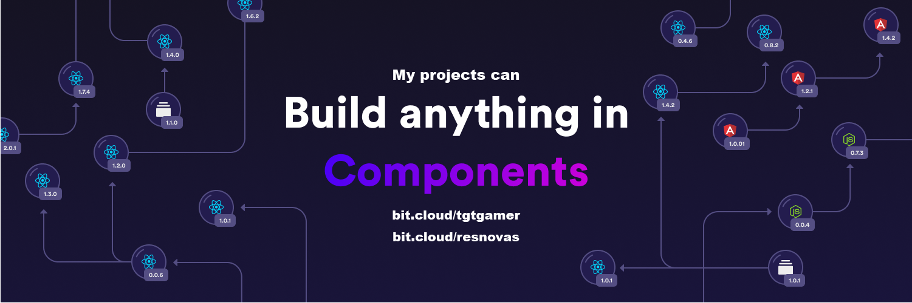

  
  

  
###  I'm Jonathan, a full-time remote developer focusing on serverless infrastructure👨‍💻

I’m currently working on [Eventiva](https://github.com/eventiva/eventiva)  
I’m currently learning [Terraform](https://www.terraform.io/), [Mitosis](https://mitosis.builder.io/) and [Qwik](https://qwik.builder.io/)  
Find me answering community coding questions in [The Coding Den](https://discord.com/invite/code) and [TypeScript Community](https://discord.gg/typescript)

 

<picture>
  <source media="(prefers-color-scheme: dark)" srcset="games/github-snake-dark.svg" />
  <source media="(prefers-color-scheme: light)" srcset="games/github-snake.svg" />
  
</picture>

<table><tr><td valign="top" width="33%">

### Frontend

  
  
  
  
  
  
  
  
  
  
  
  
  

</td><td valign="top" width="33%">

### Backend

  
  
  
  
  
  
  
  

</td><td valign="top" width="33%">

### DevOps

  
  
  
  
  
  
  

</td></tr></table>

<table style="border: none;"><tr style="border: none;"><td valign="top" width="50%" style="border: none;">

</td><td valign="top" width="50%" style="border: none;">

</td></tr></table>

<table style="border: none;"><tr style="border: none;"><td valign="top" width="80%" style="border: none;">

</td><td valign="top" width="20%" style="border: none;">

  

</td></tr></table>

 

 Activity 

  
<table><tr><td valign="top" width="50%">

<!--START_SECTION:activity-->

1. 🗣 Commented on [#670](https://github.com/Eventiva/Eventiva/pull/670#issuecomment-4058872821) in [Eventiva/Eventiva](https://github.com/Eventiva/Eventiva)
2. 🎉 Merged PR [#669](https://github.com/Eventiva/Eventiva/pull/669) in [Eventiva/Eventiva](https://github.com/Eventiva/Eventiva)
3. 🗣 Commented on [#670](https://github.com/Eventiva/Eventiva/pull/670#issuecomment-4058711128) in [Eventiva/Eventiva](https://github.com/Eventiva/Eventiva)
4. 🗣 Commented on [#670](https://github.com/Eventiva/Eventiva/pull/670#issuecomment-4058644639) in [Eventiva/Eventiva](https://github.com/Eventiva/Eventiva)
5. 💪 Opened PR [#670](https://github.com/Eventiva/Eventiva/pull/670) in [Eventiva/Eventiva](https://github.com/Eventiva/Eventiva)
6. 🗣 Commented on [#669](https://github.com/Eventiva/Eventiva/pull/669#issuecomment-4058460801) in [Eventiva/Eventiva](https://github.com/Eventiva/Eventiva)
7. 💪 Opened PR [#669](https://github.com/Eventiva/Eventiva/pull/669) in [Eventiva/Eventiva](https://github.com/Eventiva/Eventiva)
8. 🎉 Merged PR [#661](https://github.com/Eventiva/Eventiva/pull/661) in [Eventiva/Eventiva](https://github.com/Eventiva/Eventiva)
9. ❌ Closed PR [#652](https://github.com/Eventiva/Eventiva/pull/652) in [Eventiva/Eventiva](https://github.com/Eventiva/Eventiva)
10. 💪 Opened PR [#661](https://github.com/Eventiva/Eventiva/pull/661) in [Eventiva/Eventiva](https://github.com/Eventiva/Eventiva)
11. 🎉 Merged PR [#660](https://github.com/Eventiva/Eventiva/pull/660) in [Eventiva/Eventiva](https://github.com/Eventiva/Eventiva)
12. 💪 Opened PR [#660](https://github.com/Eventiva/Eventiva/pull/660) in [Eventiva/Eventiva](https://github.com/Eventiva/Eventiva)
13. 🗣 Commented on [#652](https://github.com/Eventiva/Eventiva/pull/652#issuecomment-4051303738) in [Eventiva/Eventiva](https://github.com/Eventiva/Eventiva)
14. 🗣 Commented on [#651](https://github.com/Eventiva/Eventiva/pull/651#issuecomment-4051301423) in [Eventiva/Eventiva](https://github.com/Eventiva/Eventiva)
15. 🗣 Commented on [#650](https://github.com/Eventiva/Eventiva/pull/650#issuecomment-4051300087) in [Eventiva/Eventiva](https://github.com/Eventiva/Eventiva)
16. ❌ Closed PR [#633](https://github.com/Eventiva/Eventiva/pull/633) in [Eventiva/Eventiva](https://github.com/Eventiva/Eventiva)
17. 🗣 Commented on [#649](https://github.com/Eventiva/Eventiva/pull/649#issuecomment-4051292275) in [Eventiva/Eventiva](https://github.com/Eventiva/Eventiva)
18. 🗣 Commented on [#645](https://github.com/Eventiva/Eventiva/pull/645#issuecomment-4051241022) in [Eventiva/Eventiva](https://github.com/Eventiva/Eventiva)
19. 🗣 Commented on [#644](https://github.com/Eventiva/Eventiva/pull/644#issuecomment-4051240620) in [Eventiva/Eventiva](https://github.com/Eventiva/Eventiva)
20. 🗣 Commented on [#643](https://github.com/Eventiva/Eventiva/pull/643#issuecomment-4051240112) in [Eventiva/Eventiva](https://github.com/Eventiva/Eventiva)
21. 🗣 Commented on [#642](https://github.com/Eventiva/Eventiva/pull/642#issuecomment-4051239231) in [Eventiva/Eventiva](https://github.com/Eventiva/Eventiva)
22. 🗣 Commented on [#641](https://github.com/Eventiva/Eventiva/pull/641#issuecomment-4051238439) in [Eventiva/Eventiva](https://github.com/Eventiva/Eventiva)
23. 🗣 Commented on [#639](https://github.com/Eventiva/Eventiva/pull/639#issuecomment-4051225113) in [Eventiva/Eventiva](https://github.com/Eventiva/Eventiva)
24. 🗣 Commented on [#633](https://github.com/Eventiva/Eventiva/pull/633#issuecomment-4051224119) in [Eventiva/Eventiva](https://github.com/Eventiva/Eventiva)
25. 🗣 Commented on [#640](https://github.com/Eventiva/Eventiva/pull/640#issuecomment-4051223202) in [Eventiva/Eventiva](https://github.com/Eventiva/Eventiva)
26. 🗣 Commented on [#636](https://github.com/Eventiva/Eventiva/pull/636#issuecomment-4051222139) in [Eventiva/Eventiva](https://github.com/Eventiva/Eventiva)
27. 🎉 Merged PR [#647](https://github.com/Eventiva/Eventiva/pull/647) in [Eventiva/Eventiva](https://github.com/Eventiva/Eventiva)
28. 💪 Opened PR [#647](https://github.com/Eventiva/Eventiva/pull/647) in [Eventiva/Eventiva](https://github.com/Eventiva/Eventiva)
29. ❌ Closed PR [#646](https://github.com/Eventiva/Eventiva/pull/646) in [Eventiva/Eventiva](https://github.com/Eventiva/Eventiva)
30. 💪 Opened PR [#646](https://github.com/Eventiva/Eventiva/pull/646) in [Eventiva/Eventiva](https://github.com/Eventiva/Eventiva)
31. 🎉 Merged PR [#635](https://github.com/Eventiva/Eventiva/pull/635) in [Eventiva/Eventiva](https://github.com/Eventiva/Eventiva)
32. 💪 Opened PR [#635](https://github.com/Eventiva/Eventiva/pull/635) in [Eventiva/Eventiva](https://github.com/Eventiva/Eventiva)
33. ❌ Closed PR [#610](https://github.com/Eventiva/Eventiva/pull/610) in [Eventiva/Eventiva](https://github.com/Eventiva/Eventiva)
34. ❌ Closed PR [#628](https://github.com/Eventiva/Eventiva/pull/628) in [Eventiva/Eventiva](https://github.com/Eventiva/Eventiva)
<!--END_SECTION:activity-->

</td></tr></table>

 

 
 Blogging & StackExchange 

  
<!-- BLOG-POST-LIST:START -->
- [Tensorflow React - Error: modelWeightsID must be a number or number array when import](https://stackoverflow.com/questions/74309939/tensorflow-react-error-modelweightsid-must-be-a-number-or-number-array-when-i)
- [Answer by Jonathan Stevens for Fetch status on audio stream - HTTP Response](https://stackoverflow.com/questions/67752301/fetch-status-on-audio-stream-http-response/67757137#67757137)
- [Fetch status on audio stream - HTTP Response](https://stackoverflow.com/questions/67752301/fetch-status-on-audio-stream-http-response)
- [Github Actions detect author_association](https://stackoverflow.com/questions/63188674/github-actions-detect-author-association)
- [Answer by Jonathan Stevens for React styling - Overflow issues - Expo &amp; Electron single workflow](https://stackoverflow.com/questions/59939824/react-styling-overflow-issues-expo-electron-single-workflow/59941715#59941715)
- [React styling - Overflow issues - Expo &amp; Electron single workflow](https://stackoverflow.com/questions/59939824/react-styling-overflow-issues-expo-electron-single-workflow)
- [React WebkitAppRegion Warnings](https://stackoverflow.com/questions/59870837/react-webkitappregion-warnings)
- [Dialogflow &amp; Express -- Fulfilment](https://stackoverflow.com/questions/57964582/dialogflow-express-fulfilment)
- [Answer by Jonathan Stevens for SVG Changing specific colour - CSS &amp; JS](https://stackoverflow.com/questions/51461082/svg-changing-specific-colour-css-js/51467484#51467484)
- [SVG Changing specific colour - CSS &amp; JS](https://stackoverflow.com/questions/51461082/svg-changing-specific-colour-css-js)
- [Complex Wireframe to solid for use in Autodesk 2018](https://stackoverflow.com/questions/47948929/complex-wireframe-to-solid-for-use-in-autodesk-2018)
- [Cookie based Redirection using Javascript](https://stackoverflow.com/questions/47686107/cookie-based-redirection-using-javascript)
- [How to make the bot know if its messaged someone before? C# based SteamBot](https://stackoverflow.com/questions/44035406/how-to-make-the-bot-know-if-its-messaged-someone-before-c-sharp-based-steambot)
- [How to convert fs:path to variable](https://stackoverflow.com/questions/43879791/how-to-convert-fspath-to-variable)
<!-- BLOG-POST-LIST:END -->
  

 
