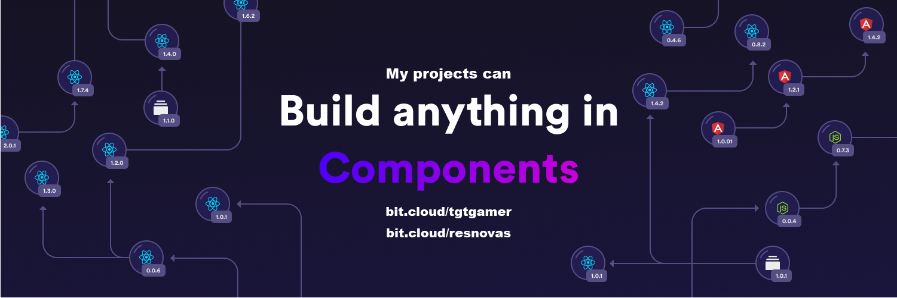

  
  

  
###  I'm Jonathan, a full-time remote developer focusing on serverless infrastructure👨‍💻

I’m currently working on [Eventiva](https://github.com/eventiva/eventiva)  
I’m currently learning [Terraform](https://www.terraform.io/), [Mitosis](https://mitosis.builder.io/) and [Qwik](https://qwik.builder.io/)  
Find me answering community coding questions in [The Coding Den](https://discord.com/invite/code) and [TypeScript Community](https://discord.gg/typescript)

 

<picture>
  <source media="(prefers-color-scheme: dark)" srcset="games/github-snake-dark.svg" />
  <source media="(prefers-color-scheme: light)" srcset="games/github-snake.svg" />
  
</picture>

<table><tr><td valign="top" width="33%">

### Frontend

  
  
  
  
  
  
  
  
  
  
  
  
  

</td><td valign="top" width="33%">

### Backend

  
  
  
  
  
  
  
  

</td><td valign="top" width="33%">

### DevOps

  
  
  
  
  
  
  

</td></tr></table>

<table style="border: none;"><tr style="border: none;"><td valign="top" width="50%" style="border: none;">

</td><td valign="top" width="50%" style="border: none;">

</td></tr></table>

<table style="border: none;"><tr style="border: none;"><td valign="top" width="80%" style="border: none;">

</td><td valign="top" width="20%" style="border: none;">

  

</td></tr></table>

 

 Activity 

  
<table><tr><td valign="top" width="50%">

<!--START_SECTION:activity-->

1. 🔓 Reopened issue [#295](https://github.com/Resnovas/smartcloud/issues/295) in [Resnovas/smartcloud](https://github.com/Resnovas/smartcloud)
2. ℹ️ Labeled issue [#295](https://github.com/Resnovas/smartcloud/issues/295) in [Resnovas/smartcloud](https://github.com/Resnovas/smartcloud)
3. 🔓 Reopened issue [#233](https://github.com/Resnovas/smartcloud/issues/233) in [Resnovas/smartcloud](https://github.com/Resnovas/smartcloud)
4. ℹ️ Labeled issue [#233](https://github.com/Resnovas/smartcloud/issues/233) in [Resnovas/smartcloud](https://github.com/Resnovas/smartcloud)
5. ℹ️ Labeled issue [#233](https://github.com/Resnovas/smartcloud/issues/233) in [Resnovas/smartcloud](https://github.com/Resnovas/smartcloud)
6. 🔓 Reopened issue [#219](https://github.com/Resnovas/smartcloud/issues/219) in [Resnovas/smartcloud](https://github.com/Resnovas/smartcloud)
7. ℹ️ Labeled issue [#219](https://github.com/Resnovas/smartcloud/issues/219) in [Resnovas/smartcloud](https://github.com/Resnovas/smartcloud)
8. ℹ️ Labeled issue [#219](https://github.com/Resnovas/smartcloud/issues/219) in [Resnovas/smartcloud](https://github.com/Resnovas/smartcloud)
9. 💪 Opened PR [#10](https://github.com/Resnovas/.github/pull/10) in [Resnovas/.github](https://github.com/Resnovas/.github)
10. 💪 Opened PR [#9](https://github.com/Resnovas/.github/pull/9) in [Resnovas/.github](https://github.com/Resnovas/.github)
11. 💪 Opened PR [#635](https://github.com/Resnovas/smartcloud/pull/635) in [Resnovas/smartcloud](https://github.com/Resnovas/smartcloud)
12. 💪 Opened PR [#8](https://github.com/Resnovas/.github/pull/8) in [Resnovas/.github](https://github.com/Resnovas/.github)
13. 💪 Opened PR [#7](https://github.com/Resnovas/.github/pull/7) in [Resnovas/.github](https://github.com/Resnovas/.github)
14. 🎉 Merged PR [#634](https://github.com/Resnovas/smartcloud/pull/634) in [Resnovas/smartcloud](https://github.com/Resnovas/smartcloud)
15. 💪 Opened PR [#634](https://github.com/Resnovas/smartcloud/pull/634) in [Resnovas/smartcloud](https://github.com/Resnovas/smartcloud)
16. 🎉 Merged PR [#632](https://github.com/Resnovas/smartcloud/pull/632) in [Resnovas/smartcloud](https://github.com/Resnovas/smartcloud)
17. 💪 Opened PR [#632](https://github.com/Resnovas/smartcloud/pull/632) in [Resnovas/smartcloud](https://github.com/Resnovas/smartcloud)
18. 🎉 Merged PR [#6](https://github.com/Resnovas/.github/pull/6) in [Resnovas/.github](https://github.com/Resnovas/.github)
19. 💪 Opened PR [#6](https://github.com/Resnovas/.github/pull/6) in [Resnovas/.github](https://github.com/Resnovas/.github)
20. 🗣 Commented on [#45](https://github.com/Resnovas/smartcloud/issues/45#issuecomment-5847917406) in [Resnovas/smartcloud](https://github.com/Resnovas/smartcloud)
21. 🔒 Closed issue [#45](https://github.com/Resnovas/smartcloud/issues/45) in [Resnovas/smartcloud](https://github.com/Resnovas/smartcloud)
22. 🗣 Commented on [#50](https://github.com/Resnovas/smartcloud/issues/50#issuecomment-5847917190) in [Resnovas/smartcloud](https://github.com/Resnovas/smartcloud)
23. 🔒 Closed issue [#50](https://github.com/Resnovas/smartcloud/issues/50) in [Resnovas/smartcloud](https://github.com/Resnovas/smartcloud)
24. 🗣 Commented on [#49](https://github.com/Resnovas/smartcloud/issues/49#issuecomment-5847916949) in [Resnovas/smartcloud](https://github.com/Resnovas/smartcloud)
25. 🔒 Closed issue [#49](https://github.com/Resnovas/smartcloud/issues/49) in [Resnovas/smartcloud](https://github.com/Resnovas/smartcloud)
26. 🗣 Commented on [#48](https://github.com/Resnovas/smartcloud/issues/48#issuecomment-5847916736) in [Resnovas/smartcloud](https://github.com/Resnovas/smartcloud)
27. 🔒 Closed issue [#48](https://github.com/Resnovas/smartcloud/issues/48) in [Resnovas/smartcloud](https://github.com/Resnovas/smartcloud)
28. 🔒 Closed issue [#47](https://github.com/Resnovas/smartcloud/issues/47) in [Resnovas/smartcloud](https://github.com/Resnovas/smartcloud)
29. 🗣 Commented on [#47](https://github.com/Resnovas/smartcloud/issues/47#issuecomment-5847916536) in [Resnovas/smartcloud](https://github.com/Resnovas/smartcloud)
30. 🔒 Closed issue [#75](https://github.com/Resnovas/smartcloud/issues/75) in [Resnovas/smartcloud](https://github.com/Resnovas/smartcloud)
31. 🗣 Commented on [#75](https://github.com/Resnovas/smartcloud/issues/75#issuecomment-5847916325) in [Resnovas/smartcloud](https://github.com/Resnovas/smartcloud)
32. 🗣 Commented on [#202](https://github.com/Resnovas/smartcloud/issues/202#issuecomment-5847916094) in [Resnovas/smartcloud](https://github.com/Resnovas/smartcloud)
33. 🔒 Closed issue [#202](https://github.com/Resnovas/smartcloud/issues/202) in [Resnovas/smartcloud](https://github.com/Resnovas/smartcloud)
34. 🔒 Closed issue [#227](https://github.com/Resnovas/smartcloud/issues/227) in [Resnovas/smartcloud](https://github.com/Resnovas/smartcloud)
<!--END_SECTION:activity-->

</td></tr></table>

 

 
 Blogging & StackExchange 

  
<!-- BLOG-POST-LIST:START -->
- [Tensorflow React - Error: modelWeightsID must be a number or number array when import](https://stackoverflow.com/questions/74309939/tensorflow-react-error-modelweightsid-must-be-a-number-or-number-array-when-i)
- [Answer by Jonathan Stevens for Fetch status on audio stream - HTTP Response](https://stackoverflow.com/questions/67752301/fetch-status-on-audio-stream-http-response/67757137#67757137)
- [Fetch status on audio stream - HTTP Response](https://stackoverflow.com/questions/67752301/fetch-status-on-audio-stream-http-response)
- [Github Actions detect author_association](https://stackoverflow.com/questions/63188674/github-actions-detect-author-association)
- [Answer by Jonathan Stevens for React styling - Overflow issues - Expo &amp; Electron single workflow](https://stackoverflow.com/questions/59939824/react-styling-overflow-issues-expo-electron-single-workflow/59941715#59941715)
- [React styling - Overflow issues - Expo &amp; Electron single workflow](https://stackoverflow.com/questions/59939824/react-styling-overflow-issues-expo-electron-single-workflow)
- [React WebkitAppRegion Warnings](https://stackoverflow.com/questions/59870837/react-webkitappregion-warnings)
- [Dialogflow &amp; Express -- Fulfilment](https://stackoverflow.com/questions/57964582/dialogflow-express-fulfilment)
- [Answer by Jonathan Stevens for SVG Changing specific colour - CSS &amp; JS](https://stackoverflow.com/questions/51461082/svg-changing-specific-colour-css-js/51467484#51467484)
- [SVG Changing specific colour - CSS &amp; JS](https://stackoverflow.com/questions/51461082/svg-changing-specific-colour-css-js)
- [Complex Wireframe to solid for use in Autodesk 2018](https://stackoverflow.com/questions/47948929/complex-wireframe-to-solid-for-use-in-autodesk-2018)
- [Cookie based Redirection using Javascript](https://stackoverflow.com/questions/47686107/cookie-based-redirection-using-javascript)
- [How to make the bot know if its messaged someone before? C# based SteamBot](https://stackoverflow.com/questions/44035406/how-to-make-the-bot-know-if-its-messaged-someone-before-c-sharp-based-steambot)
- [How to convert fs:path to variable](https://stackoverflow.com/questions/43879791/how-to-convert-fspath-to-variable)
<!-- BLOG-POST-LIST:END -->
  

 
